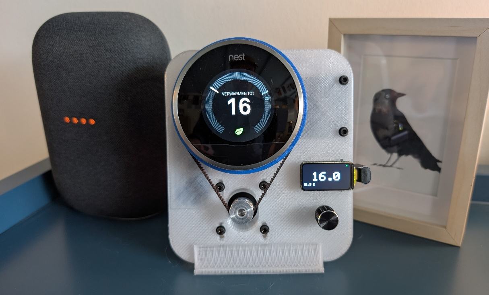
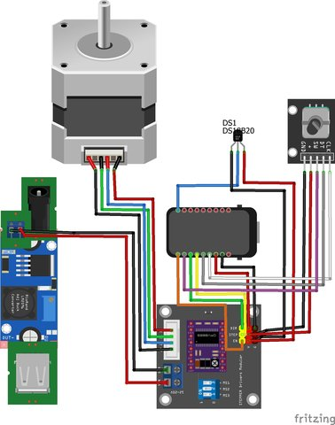

# NastyThermostat

**Mechanically control a Nest Gen2 thermostat locally — no cloud, no API, full automation.**

A Nest Gen2 thermostat that lost Google connectivity? NastyThermostat gives it a second life by physically turning the dial using a stepper motor, GT2 belt and 3D-printed gear — controlled by an ESP32-C6 with full MQTT, Domoticz and Home Assistant integration.



---

## How it works

```
ESP32-C6  →  DRV8825 driver  →  NEMA17 stepper  →  GT2 belt  →  Nest dial
```

The ESP32-C6 reads a DS18B20 temperature sensor and receives setpoints via rotary encoder, MQTT or HTTP API. It then calculates how many steps to move and physically rotates the Nest dial to the target temperature.

---

## Features

- 🌡️ DS18B20 local temperature sensor
- 🎛️ Rotary encoder for manual control
- 📺 ST7789 TFT display (1.47")
- 📡 MQTT publish/subscribe (temperature + setpoint)
- 🏠 Domoticz integration (IDX based)
- 🤖 Home Assistant MQTT Discovery (climate entity)
- 🌐 HTTP REST API
- 🔧 WiFiManager configuration portal
- 💾 Persistent settings (ESP32 Preferences)
- ⚡ Stepper power management (auto-disable when idle)

---

## Hardware

| Component | Description |
|---|---|
| ESP32-C6 | Waveshare ESP32-C6 LCD 1.47 (ST7789 display included) |
| NEMA17 | Stepper motor |
| DRV8825 | Stepper driver module |
| DS18B20 | Temperature sensor |
| HW-040 | Rotary encoder with button |
| GT2 belt + pulleys | 20T motor pulley, 138T Nest pulley (3D printed) |

### Pin mapping



| Function | GPIO |
|---|---|
| TFT CS | 14 |
| TFT DC | 15 |
| TFT RST | 21 |
| TFT Backlight | 22 |
| TFT MOSI | 6 |
| TFT SCLK | 7 |
| Stepper STEP | 2 |
| Stepper DIR | 3 |
| Stepper ENABLE | 5 |
| Encoder CLK | 0 |
| Encoder DT | 1 |
| Encoder Button | 4 |
| DS18B20 | 9 |

---

## 3D Printed Parts

STL files are in the `/3d-models/` folder. Print the Nest pulley (138T) and motor mount in PLA or PETG, 30% infill minimum. The pulley attaches directly to the Nest dial ring.

---

## Installation

### 1. Flash the firmware

The easiest way is via the web flasher — no software needed:

👉 **[Flash NastyThermostat via browser](https://nastythermostat.github.io/NastyThermostat/webflash/)**

Or build yourself using PlatformIO:

```bash
git clone https://github.com/nastythermostat/NastyThermostat.git
cd NastyThermostat
# Copy and edit secrets template
cp include/SecretsTemplate.h include/arduino_secrets.h
# Build & upload
pio run --target upload
```


## Configuration

### First boot — WiFiManager portal

On first boot (or when WiFi is not found), the device creates an access point:

```
SSID: NastyThermostat (or NastyThermostatXXXXXX with unique MAC suffix)
URL:  http://192.168.4.1
```

Connect to this AP and open the portal. All settings are configured here:

| Setting | Description |
|---|---|
| **Device name** | Unique name used for MQTT topics and AP SSID. Default: `NastyThermostatXXXXXX` |
| **MQTT server** | IP or hostname of your MQTT broker. Leave empty to disable MQTT. |
| **MQTT port** | Default: `1883` |
| **Domoticz IDX temperature** | Domoticz virtual sensor IDX for temperature. Leave `0` to disable. |
| **Domoticz IDX setpoint** | Domoticz virtual sensor IDX for setpoint. Leave `0` to disable. |
| **Domoticz gateway OUT mode** | `index` (default) = subscribe to `domoticz/out/{idx}`. `flat` = subscribe to `domoticz/out` and filter by IDX. |
| **Homing after receiving setpoint** | `on` (default): performs full homing before moving to new setpoint (most accurate). `off`: performs a small wake-jiggle instead (faster, less mechanical wear). |
| **Home Assistant MQTT Discovery** | `on` (default): automatically creates a climate entity in Home Assistant. |
| **HTTP API token** | Token required for POST requests to `/api`. Leave empty to disable writes. Type `clear` to remove an existing token. |
| **MQTT publish interval** | How often temperature is published in seconds. Default: `30`. |

### Re-opening the portal

From the on-device menu: **5. WiFi setup → Start WiFi portal (reboot)**

Or hold the encoder button for 5 seconds at boot.

---

## MQTT Topics

Topics are based on the device name (configurable). Default: `NastyThermostatXXXXXX`

| Topic | Direction | Description |
|---|---|---|
| `{deviceName}/out/temp` | Publish | Current temperature (°C) |
| `{deviceName}/out/setpoint` | Publish (retained) | Current setpoint (°C) |
| `{deviceName}/in/setpoint` | Subscribe | Set new setpoint (plain float, e.g. `21.5`) |
| `{deviceName}/out/availability` | Publish (retained) | `online` / `offline` (LWT) |
| `{deviceName}/out/action` | Publish (retained) | `heating` or `idle` |
| `{deviceName}/out/mode` | Publish (retained) | `heat` (always, for HA) |

### Domoticz

NastyThermostat subscribes to Domoticz setpoint changes and publishes temperature and setpoint back to Domoticz using the configured IDX numbers.

```
Subscribe: domoticz/out/{idxSetpoint}   (index mode, default)
           domoticz/out                  (flat mode, filtered by idx)
Publish:   domoticz/in
```

### Home Assistant

With MQTT Discovery enabled, a `climate` entity is automatically created in HA showing current temperature, setpoint, and heating/idle action. No manual YAML needed.

---

## HTTP API

The device hosts a REST API on port 80.

### GET /api — Status

```bash
curl http://192.168.x.x/api
```

Response:
```json
{
  "device_name": "NastyThermostat123456",
  "setpoint": 20.5,
  "temperature": 19.8,
  "offset": 0.0,
  "stepSize": 0.1,
  "motor_position": 14420,
  "steps_per_degree": 856.0,
  "mqtt_enabled": true,
  ...
}
```

### POST /api — Update settings

Requires token (set in WiFiManager portal).

```bash
curl -X POST http://192.168.x.x/api \
  -H "Content-Type: application/json" \
  -d '{"token":"yourtoken","setpoint":21.0}'
```

Available POST fields:

| Field | Type | Description |
|---|---|---|
| `token` | string | **Required**. API token set in portal. |
| `setpoint` | float | New setpoint in °C (9.0–32.0) |
| `offset` | float | Temperature offset correction (-10.0 to 10.0) |
| `stepSize` | float | Encoder step size: `0.1`, `0.2`, `0.5` or `1.0` |
| `steps_per_degree` | float | Calibration: microsteps per °C (10–2000) |

---

## On-device menu

Press the encoder button to open the menu. Rotate to navigate, press to select.

| Menu item | Description |
|---|---|
| 1. Homing | Perform a manual homing cycle (moves to mechanical stop, resets position to 0) |
| 2. Temperature offset | Correct DS18B20 reading. Turn to adjust ±10°C, press to save. |
| 3. Steps/degree | Calibration value in microsteps/°C. Turn to adjust, press to save. |
| 4. Step size | Encoder step size: 0.1 / 0.2 / 0.5 / 1.0°C |
| 5. WiFi setup | Open WiFiManager portal (device reboots into AP mode) |
| 6. Status | Shows firmware version, WiFi IP, MQTT connection status |
| 7. Back | Return to main screen |

---

## Display

The main screen shows:
- **Large center**: current setpoint (°C)
- **Bottom left**: measured temperature (°C)
- **Top right**: WiFi status icon (green = connected, red = disconnected)
- **Background**: orange when heating (setpoint > temperature), black when idle

Screen auto-off after 15 seconds of inactivity. Any encoder movement or motor activity wakes the display.

---

## Calibration

The default `steps_per_degree` value is **26.75 full-steps/°C** (= 856 microsteps at 1/32). This is based on the 138T/20T pulley ratio. If your Nest doesn't hit the right temperatures, adjust via:

- Menu item **3. Steps/degree**
- Or via HTTP API: `{"token":"...","steps_per_degree": 856.0}`

---

## Serial commands

Connect via Serial Monitor at 115200 baud:

| Command | Description |
|---|---|
| `?` or `h` | Show status banner (IP, MQTT, topics) |
| `i` | Show WiFi and MQTT connection status |

---

## Troubleshooting

**Motor moves but Nest temperature is wrong**
→ Adjust Steps/degree in menu or via API. Start with small increments.

**WiFi not connecting**
→ Hold encoder button 5 seconds at boot to force portal mode.

**MQTT not connecting**
→ Check Serial Monitor output at 115200 baud. Verify broker IP and port in portal.

**DS18B20 reads 0°C or wrong temperature**
→ Check wiring on GPIO9. Use temperature offset in menu to correct.

**Homing misses the mechanical stop**
→ A 15-second safety timeout will stop the motor automatically.

---

## License

MIT — see [LICENSE](LICENSE)
